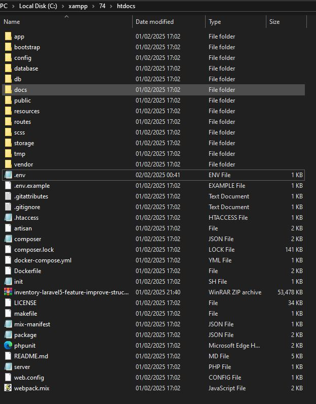

# Project Inventory Laravel
This project is based on
<a href="https://www.youtube.com/watch?v=dqBLvR7lC8k" target="_blank">INVENTORY</a>
and has been adapted for easier installation in environments such as XAMPP, cPanel, and Docker. Adjustments have been made to optimize deployment and compatibility, ensuring a more accessible experience for various use cases.

## Laravel Upgrade History

This project has been progressively upgraded through multiple Laravel versions to maintain compatibility and take advantage of new features and improvements:

* Laravel 5.5 → 5.6: Minor updates and security fixes.
* Laravel 5.6 → 5.7: Added new middleware features and improvements in error handling.
* Laravel 5.7 → 5.8: Improved email validation, automatic policy discovery, and performance optimizations.
* Laravel 5.8 → 6.x: Transitioned to LTS (Long-Term Support), replaced str_slug() with Str::slug(), and introduced improved job middleware.
* Laravel 6.x → 7.x: Added Laravel Airlock (now Sanctum), better routing speed, Blade component tags, and fluent string operations.
* Laravel 7.x → 8.x: Introduced Laravel Jetstream, model factory classes, migration squashing, and rate limiting improvements.
* Laravel 8.x → 9.x: Updated minimum PHP requirement to 8.0, migrated from Vue 2 to Vue 3, replaced webpack with Vite, and added Laravel Sail for development environment.

## Important Changes
If you are upgrading from an older version, please consider the following adjustments:

* The str_slug() helper function has been removed in Laravel 6. Instead, use Str::slug().
* swiftmailer/swiftmailer has been deprecated in favor of symfony/mailer.
* symfony/debug has been replaced with symfony/error-handler.
* The default CSRF directive has been updated from {{ csrf_field() }} to @csrf for better readability and maintainability.
* Laravel 8 requires PHP 7.3 or higher.
* Model factories have been completely redesigned in Laravel 8. The new class-based factory implementation provides better type-hinting and support for named arguments.
* Models are now placed in the App\Models directory by default in Laravel 8.
* Route definitions now use class name syntax for controller references (e.g., `UserController::class` instead of 'UserController').
* Laravel 8 includes a new maintenance mode experience with pre-rendered views.

### Laravel 9 Upgrade Changes
* Laravel 9 requires PHP 8.0 or higher. (This project uses PHP 8.2)
* The project has been migrated from Vue 2 to Vue 3, which includes breaking changes in the Vue API.
* Webpack has been replaced with Vite for faster and more efficient asset building.
* Unnecessary JavaScript files have been removed to optimize the codebase.
* Laravel Sail has been added for a more consistent development environment.
* Database migrations and seeders are now used for both development and production environments, with specific seeders for each environment.
* In resources/js/bootstrap.js, the project attempts to import 'bootstrap', 'popper.js', and 'jquery', but these dependencies are not installed in node_modules. This doesn't cause build failures but will be removed in Laravel 10.

## Installation

* [Docker installation](#Docker-installation)
* [Cpanel installation](#Cpanel-installation)
* [Xampp installation](#Xampp-installation)

## Docker installation

### Requirements

Your system needs the following programs:
* Docker
* Docker Compose

### Steps

Clone the project from the repository url.
```shell
git clone <repository url>
```

Enter the directory.
```shell
cd <directory name>
```

Copy the .env.example file to .env and configure your environment variables.
```shell
cp .env.example .env
```

After copying the .env file, you may need to modify the database credentials in the .env file according to your environment:
```dotenv
DB_CONNECTION=mysql
DB_HOST=your_host
DB_PORT=your_port
DB_DATABASE=your_database
DB_USERNAME=your_username
DB_PASSWORD=your_password
```

Create a new docker network using the name "inventory".
```shell
docker network create inventory
```

Install Composer dependencies using Docker (this step is necessary because the vendor directory is not included in the repository):
```shell
docker run --rm \
    -u "$(id -u):$(id -g)" \
    -v "$(pwd):/var/www/html" \
    -w /var/www/html \
    laravelsail/php82-composer:latest \
    composer install --ignore-platform-reqs
```

Use Laravel Sail to start the development environment.
```shell
./vendor/bin/sail up -d  # For first-time execution
# OR
./vendor/bin/sail build --no-cache  # If you already have other projects using Sail
```

Generate the application key:
```shell
./vendor/bin/sail artisan key:generate
```

Run database migrations and seeders.
```shell
./vendor/bin/sail artisan migrate
./vendor/bin/sail artisan db:seed --class=DevelopmentSeeder  # For development environment
# OR
./vendor/bin/sail artisan db:seed --class=ProductionSeeder   # For production environment
```

Install NPM dependencies and build assets with Vite.
```shell
./vendor/bin/sail npm install
./vendor/bin/sail npm run dev  # For development - starts Vite server and references assets with @vite()
# OR
./vendor/bin/sail npm run build  # For production - generates public/build directory
```

Note: If the project doesn't have the public/build directory, you need to generate it with `npm run build`. If you want to work in development mode, use `npm run dev` which will start the Vite server and reference all assets with @vite() directive in your views.

### Laravel Sail Commands
Laravel Sail provides a simple CLI for interacting with Laravel's default Docker development environment. Here are some useful commands:

```shell
./vendor/bin/sail up -d         # Start the containers in the background
./vendor/bin/sail down          # Stop the containers
./vendor/bin/sail artisan ...   # Run Artisan commands
./vendor/bin/sail npm ...       # Run NPM commands
./vendor/bin/sail composer ...  # Run Composer commands
```

For more information about Laravel Sail, refer to the [official documentation](https://laravel.com/docs/9.x/sail).

For convenience, you may want to add a Bash alias for Laravel Sail:
```shell
alias sail='sh $([ -f sail ] && echo sail || echo vendor/bin/sail)'
```
This allows you to run Sail commands more easily, for example: `sail up -d` instead of `./vendor/bin/sail up -d`.

### Observations
If you are using a 'Windows' operating system, please note that sometimes there may be an issue with networks. Therefore, before creating a new network, you will need to run the following command.
```shell
docker network prune
```
The above command deletes all networks.

## Cpanel installation
These files does not need any modification, it includes an .htaccess file for the correct functioning of the routes without needing to alter the structure of the original project.

### Local Development First
It's recommended to first generate and set up the entire project locally, and then upload it to the server:

1. Set up the project locally following the steps in the XAMPP or Docker installation sections.
2. Build the assets for production:
   ```shell
   npm install
   npm run build
   ```
3. You can choose to either:
   - Generate the vendor directory locally and include it when uploading to the server, or
   - Exclude the vendor directory and generate it on the server (see Server Configuration below)
4. Upload the project to your server via rsync or FTP:
   ```shell
   # Example using rsync (excluding vendor - will be generated on server)
   rsync -avz --exclude='.git' --exclude='node_modules' --exclude='vendor' /path/to/local/project/ username@your-server:/path/to/public_html/

   # Example including vendor directory (if you generated it locally)
   rsync -avz --exclude='.git' --exclude='node_modules' /path/to/local/project/ username@your-server:/path/to/public_html/
   ```

### Server Configuration
After uploading the project to your server:

* In your cPanel, set the PHP version to 8.2. While Laravel 9 requires PHP 8.0+, this project is optimized for PHP 8.2.
* Copy the .env.example file and rename it to .env on the server (or upload your pre-configured .env file). Then, update the credentials and settings according to your environment.
* Generate a new application key for security:
  ```shell
  php artisan key:generate
  ```
* Run database migrations and seeders:
  ```shell
  php artisan migrate
  php artisan db:seed --class=ProductionSeeder
  ```
* If you didn't upload the vendor directory, install Composer dependencies on the server:
  ```shell
  composer install --no-dev --optimize-autoloader
  ```

For production mode set `APP_DEBUG` to `false`

```dotenv
APP_NAME=Inventory
APP_ENV=production
# The APP_KEY below is just an example. Generate your own key with php artisan key:generate
APP_KEY=base64:yru13Kb0wYKh81NezXu2mR9efx33PrawOgfhQ7XcGKM=
APP_DEBUG=false
APP_LOG_LEVEL=error
APP_URL=https://yourdomain.site

DB_CONNECTION=mysql
DB_HOST=localhost
DB_PORT=3306
DB_DATABASE=your_database_name
DB_USERNAME=your_database_username
DB_PASSWORD=your_database_password
```

### Files to Exclude When Uploading
When uploading to the server, exclude the following directories and files:
* `node_modules/` - NPM dependencies (large and not needed on the server)
* `vendor/` - Composer dependencies (see point #3 in "Local Development First" - you can either include this if generated locally or exclude it and generate it on the server)
* `.git/` - Git repository files
* `.env` - Environment configuration (optional - you can either configure it locally and upload it, or create and configure it on the server)
* `storage/*.key` - Encryption keys
* Any other development-specific files

## Xampp installation
The project configuration only allows installation in the htdocs folder and not in child folders.
<br>
This project requires PHP version 8.0 or higher for Laravel 9, with PHP 8.2 being the preferred version. It is recommended to download XAMPP with PHP version 8.2 for optimal compatibility.

### Local Development Setup

* Download and import this repository content in your `htdocs` directory.
* Copy the .env.example file and rename it to .env. Then, update the credentials and settings according to your environment.
* Install Composer dependencies (this step is necessary because the vendor directory is not included in the repository):
  ```shell
  composer install
  ```
* Generate a new application key for security:
  ```shell
  php artisan key:generate
  ```
* Run database migrations and seeders:
  ```shell
  php artisan migrate
  php artisan db:seed --class=DevelopmentSeeder  # For development environment
  ```
* Install NPM dependencies and build assets with Vite:
  ```shell
  npm install
  npm run dev  # For development
  # OR
  npm run build  # For production
  ```

Example .env configuration (make sure to generate your own APP_KEY):

```dotenv
APP_NAME=Inventory
APP_ENV=local
# The APP_KEY below is just an example. Generate your own key with php artisan key:generate
APP_KEY=base64:snRgYbevQFPo68EIDKeUuOTvA1vW3D/M/rm1/8mqC00=
APP_DEBUG=true
APP_LOG_LEVEL=debug
APP_URL=http://localhost/

DB_CONNECTION=mysql
DB_HOST=localhost
DB_PORT=3306
DB_DATABASE=inventory
DB_USERNAME=root
DB_PASSWORD=
```

### Deploying to Production
If you're developing locally with XAMPP and plan to deploy to a production server:

1. Follow the steps in the "Local Development Setup" section above.
2. Build the assets for production:
   ```shell
   npm run build
   ```
3. Upload the project to your server via rsync or FTP, excluding unnecessary files (see "Files to Exclude When Uploading" in the cPanel installation section).
4. Configure the server environment as described in the "Server Configuration" section of the cPanel installation guide.

### Running the Application
* The result of your project structure is like:
  <br> 

* Run the URL in your web browser `http://localhost`.

## Summary of Changes
* Upgraded Laravel from 5.5 → 9.x step by step.
* Updated PHP version requirements to 8.0 or higher for Laravel 9.
* Migrated from Vue 2 to Vue 3 for improved performance and composition API.
* Replaced webpack with Vite for faster and more efficient asset building.
* Added Laravel Sail for a more consistent development environment.
* Implemented database migrations and seeders for both development and production environments.
* Removed unnecessary JavaScript files to optimize the codebase.
* Switched from `csrf_field()` to `@csrf` for better readability.
* Adjusted deprecated functions and dependencies.
* Restructured model factories to use the new class-based approach.
* Updated routing syntax to use `::class` notation.
* Improved documentation for installation and upgrades.

## Default Credentials
Remember the default credentials:

* Email: `admin@inventory.org`
* Password: `123123`

Enjoy it!
